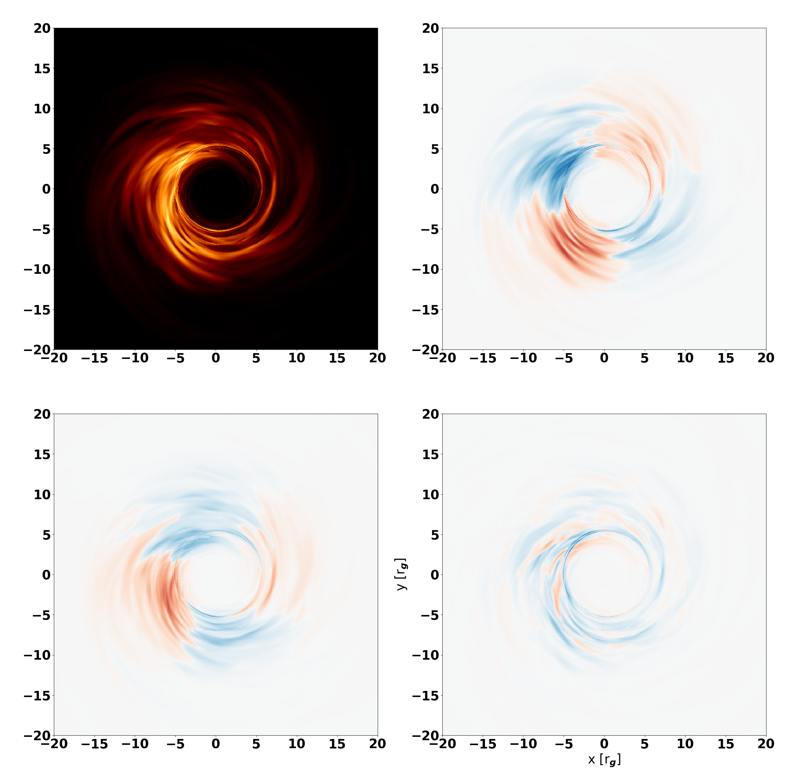

# RAPTOR++

This is the developer branch of RAPTOR. 
Contributors; Jordy Davelaar, Thomas Bronzwaer.

Papers;
Bronzwaer, Davelaar et al. 2018, A&A, 613, A2
Davelaar, Bronzwaer et al. 2018, CompAC, 5, 1, 1
Bronzwaer, Younsi, Davelaar et al. 2020, 641, A126

# Installation

RAPTOR needs hdf5, gsl, and openmp libraries.

RAPTOR is compilied via a makefile. This makefile needs the enviroment variable "RAPTOR" which can be set via,

```
export RAPTOR=/path/to/code
```

It is recommended to add this to your bash/zsh profiles.

To compile, first make a *copy* of the *run* directory outside of the code directory. Compile *only* if the run directory is outside of the code directory to keep a clean example present.

# Running RAPTOR

RAPTOR run command is given by

```
./RAPTOR model.in <path/to/grmhd/file> inclination output-index
```

```  model.in ```  contains model parameters. See below for an explanation

``` Inclination ``` set the inclination between  the line of sight of the observer and the angular momentum axis of the black hole and is in degrees.

``` output-index ``` is an integer that allows the user to set the output index of the writen hdf5 file.

# Model file

The model.in file allows to pass on code specific variables that are not needed during complication. This allows some flexibility in that the code does not have to be recompiled if one of these variables are changes.

The model file contains the following parameters


```MBH``` - Black hole mass

```M_UNIT``` - Mass scaling

```ABSORPTION``` - Currently not used by the code

```TEMP_MODEL``` - Currently not used by the code

```SPHERICAL_ACC``` - Currently not used by the code

```IMG_WIDTH``` - Amount of pixels in the x direction

```IMG_HEIGHT``` - Amount of pixels in the y direction

```CAM_SIZE_X``` - The FOV in the x direction

```CAM_SIZE_Y``` - The FOV in the y direction

```FREQS_PER_DEC``` - The amount of frequencies per logaritmic decade

```FREQ_MIN``` - Starting frequencies of the frequency array

```FREQ_MAX``` - Currently not used by the code

```STEPSIZE``` - Stepsize scaling

```MAX_LEVEL``` - Amount of adaptive levels allowed on the image domain

# Output

The output consist of an hdf5 file containing the images at all stokes parameters at all frequencies. Python scripts are provided in the *python* directory that explain how to read in and generate figures. 

<p align="center">
  
</p>
