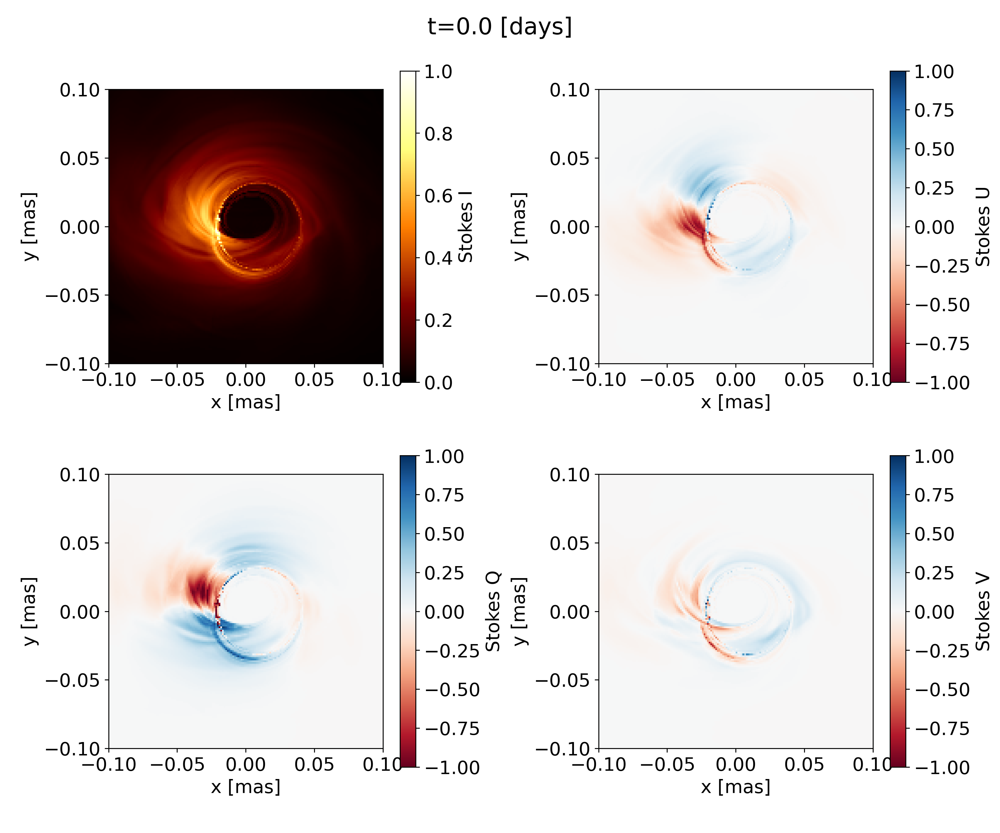

# RAPTOR

This is the public version of RAPTOR.

Main developers; Thomas Bronzwaer, Jordy Davelaar

Contributors; Ziri Younsi, Monika Moscibrodzka, Joost de Kleuver, Bram van der Berg, Renze Oosterhuis

Code-related papers;

Bronzwaer, Davelaar et al. 2018, A&A, 613, A2

Davelaar, Bronzwaer et al. 2018, CompAC, 5, 1, 1

Bronzwaer, Younsi, Davelaar et al. 2020, A&A, 641, A126

Davelaar and Haiman 2022, PRD, 105, 10, 103010 

# Installation

RAPTOR needs hdf5, gsl, and OpenMP libraries.

RAPTOR is compiled via a makefile. This makefile needs the environment variable "RAPTOR" which can be set via,

```
export RAPTOR=/path/to/code
```

It is recommended to add this to your bash/zsh profiles.

To set up a RAPTOR run, first create a run directory. Copy setup.sh to the run directory. Run setup.sh


```
$RAPTOR/setup.sh <OPTIONS>
```

where ```raptor-model```, is the model corresponding with the folder name in *RAPTOR/model*. The script checks if model files are present and only overwrites if source model files are newer than user model files. For recompiling the code recommended to use ```make all```.   

The setup script takes various arguments;

``` -c/--code ``` harm3d, bhac, HAMR

grmhd code to interface with currently supported HARM3D, HAMR or BHAC.

``` -i/--int ``` rk2, rk4, rk45, ver
integrator for geodesic integration; options are Runge-Kutta (RK) integrators of varying order, RK2 and RK4, an adaptive RK integrator RK45 or Verlet scheme.

``` -m/--metric ``` mks, cks
metric type, mks = Modified Kerr-Schild but specific for either HARM3D of BHAC, or Cartesian Kerr-Schild (BHAC only)
 

``` -g/--grid ``` amr, smr
camera grid type, amr = adaptive grid, smr= static grid. Adaptive, adds resolution during run time, static refines before computing emission and stays fixed during runtime.
 
 
``` -r/--rad ``` pol, unpol
Perform the radiation transport either polarized or unpolarized.

For BHAC simulations, there are two additional flags

``` -s/--sfc ``` sfc
If this flag is used, data is read based on Morton ordered Z curve

``` -b/--bflip ``` plus. minus
Sets the polarity of the used B field.

# Running RAPTOR

RAPTOR run command is given by

```
./RAPTOR model.in <path/to/grmhd/file> output-index
```

```  model.in ```  contains model parameters. See below for an explanation

``` <path/to/grmhd/file> ``` path to grmhd file one wants to run

``` output-index ``` is an integer that allows the user to set the output index of the written hdf5 file.

# Model file

The model.in file allows us to pass on code-specific variables that are not needed during compilation. This allows some flexibility in that the code does not have to be recompiled if one of these variables is changed.

The model file contains the following parameters.

Model dependent parameters;

```MBH``` - Black hole mass in gram

```M_UNIT``` - Mass scaling in gram

```R_HIGH``` - Temperature ratio parameter based on Moscibrodzka et al. 2016

```R_LOW``` - Temperature ratio parameter based on Moscibrodzka et al. 2016


Camera dependent parameters

```INCLINATION``` - Observer inclination in degrees

```IMG_WIDTH``` - Amount of pixels in the x direction

```IMG_HEIGHT``` - Amount of pixels in the y direction

```CAM_SIZE_X``` - The FOV in the x direction in GM/c^2

```CAM_SIZE_Y``` - The FOV in the y direction in GM/c^2

```FREQS_PER_DEC``` - The number of frequencies per logarithmic decade

```FREQ_MIN``` - Starting frequencies of the frequency array in Hz

```STEPSIZE``` - Stepsize scaling

```MAX_LEVEL``` - Amount of adaptive levels allowed on the image domain

# Output

The output consists of an hdf5 file containing the images at all stokes parameters at all frequencies and a spectral file containing total integrated stokes parameters at every frequency.


There is a Python library ``` rapplot.py ``` with functions to handle data read-in and plotting. Add the Python directory to your Python path e.g.;

``` export PYTHONPATH=$RAPTOR/python/plotting:$PYTHONPATH ```

to use ``` import rapplot ```. More usage explanations can be found in the README soon.
 
Python script ``` plotter-example.py ``` is provided in the *python* directory that explain how to read in and generate a stokes I only figure.

# Tutorial

Two short tutorials to make either an image or a spectrum

# Images

In this short tutorial, we will generate an image from a BHAC grmhd model.

Step 1: Compile the RAPTOR code in a designated run directory by using the following command:

``` $RAPTOR/setup.sh -m=mks -c=bhac -r=pol -s=sfc```

This step assumes you cloned the code to your computer. And you set your environment variable by running:

``` export RAPTOR=/path/to/code ```

Step 2: Download an example BHAC GRMHD snapshot to your run directory

``` wget https://astro.ru.nl/~jordyd/data2000.dat ```

Step 3: run RAPTOR by executing

```./RAPTOR model.in data2000.dat 0 ```

The code should finish with stating the amount of computed flux :

``` Frequency 2.30000e+11 Hz Integrated flux density = 3.63027e+00 Jy ```

Step 4: Copy the plotter-example.py to the run directory. This can be found in the folder ``` $RAPTOR/python/plotting```. 
Make sure you added the Python folder to your Python path

``` export PYTHONPATH=$RAPTOR/python/plotting:$PYTHONPATH ```

and run

```python3 plotter-example.py 0 ```

This will generate a figure with four panels. Each panel represent a component of the stokes vector. The figure can be found in your run directory's "figure" folder. See below the figure for the standard model.in parameters!

Challenge: changes the parameters in model.in to vary the image properties, such as inclination, black hole mass, or Munit.

That's all folks! 

<p align="center">
  
</p>

# Spectra

In this short tutorial, we will generate a spectrum from a BHAC grmhd model. If you already did the Images tutorial, the first two steps should be familiar.

Step 1: Compile the RAPTOR code in a designated run directory by using the following command:

``` $RAPTOR/setup.sh -m=mks -c=bhac -r=pol -s=sfc -n=20```

This step assumes you cloned the code to your computer. And you set your environment variable by running:

``` export RAPTOR=/path/to/code ```

An important difference with the Images tutorial is the addtion of the ```-n=20``` variable. This variable sets the total amount of frequencies to be computed to twenty. 

Step 2: Download an example BHAC GRMHD snapshot to your run directory

``` wget https://astro.ru.nl/~jordyd/data2000.dat ```

Step 3: 

RAPTOR can compute spectra in two ways, either by assuming the frequencies are logarithmically spaced or by providing a file with frequencies. We will assume in this tutorial the first option. There are two important parameters in the model.in file if it comes to generating spectra, 

```FREQS_PER_DEC``` - The number of frequencies per logarithmic decade

```FREQ_MIN``` - Starting frequencies of the frequency array in Hz

Set the first parameter to 4, and the second one to 1e10. This way, we will generate frequencies from 1e10 to 1e15, with 4 frequencies per logarithmic decade.

Step 4: run RAPTOR by executing

```./RAPTOR model.in data2000.dat 0 ```

The code should finish with stating the amount of computed flux for every frequency. 

Step 5: Results

The spectra are written in the output directory. In our example, this will be ``` output/spectrum_0.dat```. If you open the file you will see that it will contain five columns, the first one is the frequency in units of Hz, the next four are the Stokes parameters, I, Q, U, V in units of Jansky.

That's all folks! 

